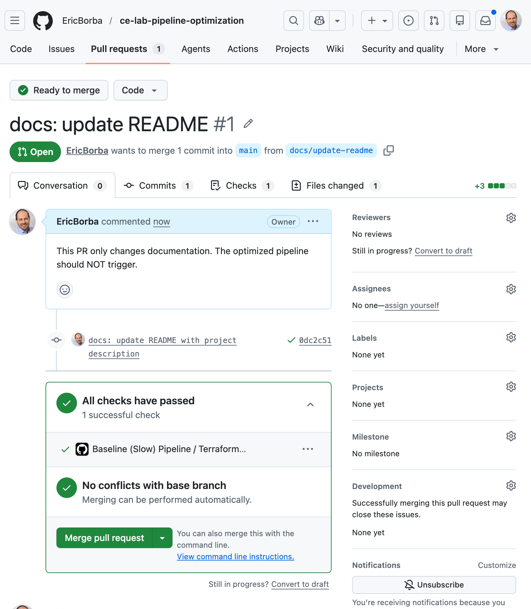
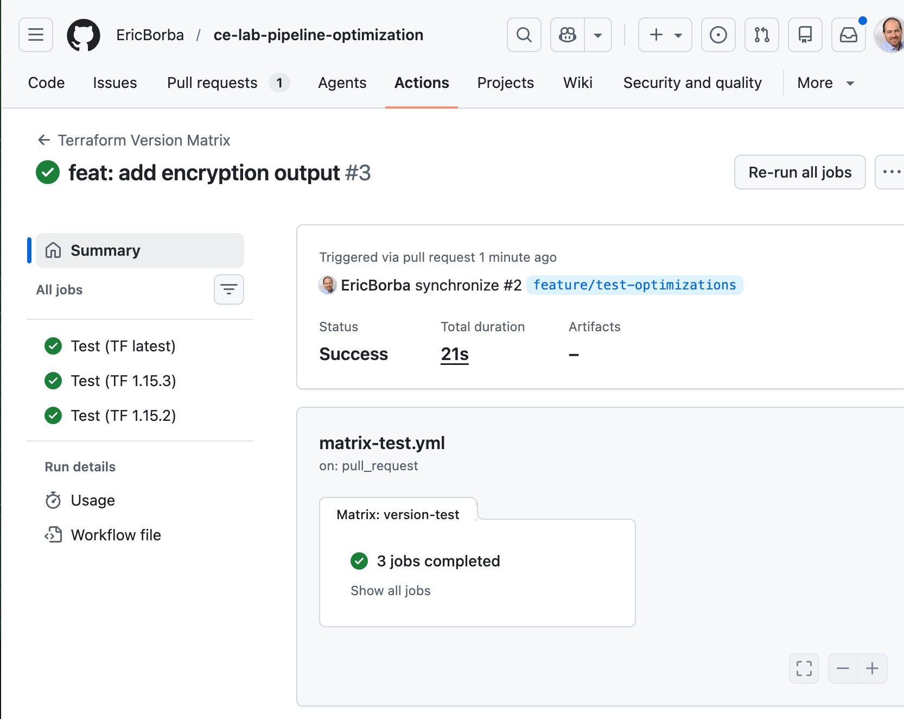
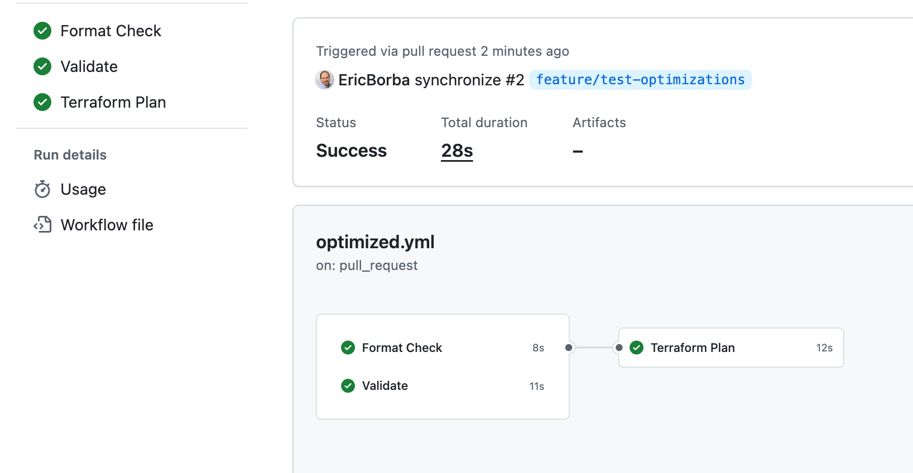
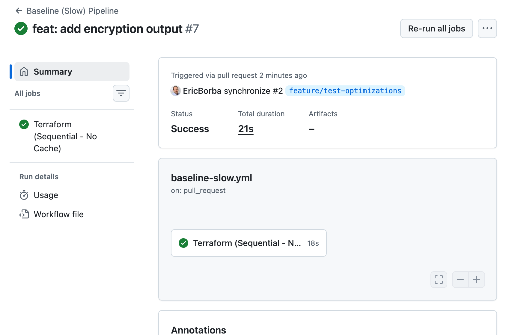
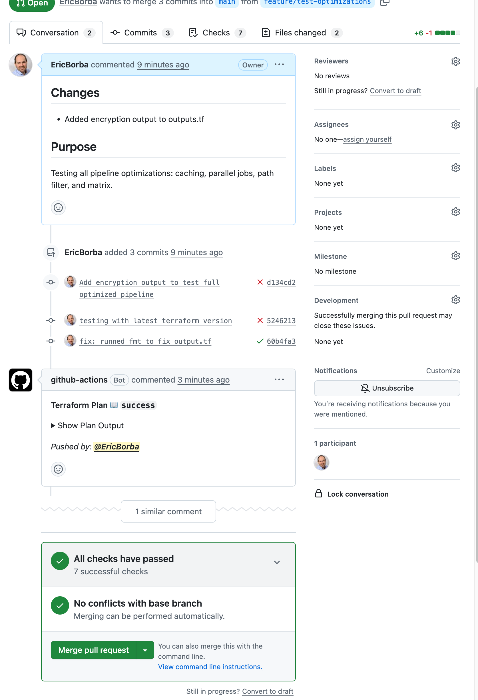

# Lab M5.09 - Pipeline Optimization

## Pipeline Performance Comparison

| Metric | Baseline (Slow) | Optimized |
|--------|-----------------|-----------|
| Total Duration | 0 min 21 sec | 0 min 28 sec |
| `terraform init` | ~18 sec (no cache) | cached (skips provider downloads) |
| Job Structure | 1 sequential job | 3 parallel jobs |
| Path Filtering | None (runs on all changes) | `terraform/**` only |
| Version Testing | Single version | Matrix (latest, 1.15.3, 1.15.2) |

> **Why was the optimized pipeline slower in this run?**
>
> The optimized pipeline clocked **28s** against the baseline's **21s**. This is expected behaviour for short-lived jobs: every GitHub Actions job spins up a **fresh runner VM** regardless of whether it runs in parallel or not. Parallelism exchanges sequential wall-clock time for simultaneous VM startup overhead — but the startup cost (~10s per runner) only pays off when each job is long enough (typically 1–2 minutes of real work) to amortise it. Here, `fmt -check` takes 8s and `validate` takes 11s, so spinning up two extra runners costs more than the time saved by running them at the same time. In a production pipeline where `terraform init` with a large provider graph, extended test suites, or multi-module validation runs for several minutes, the same parallelism technique would yield a significant reduction in total wall-clock time.

## Optimizations Applied

1. **Dependency Caching** — `actions/cache@v4` stores `.terraform/` providers between runs. On cache hit, `terraform init` skips provider downloads entirely. The cache key uses a hash of `.terraform.lock.hcl` so it busts automatically when provider versions change.

2. **Job Parallelization** — `lint` (format check) and `validate` run simultaneously with no `needs` dependency between them. `plan` waits for both to pass via `needs: [lint, validate]`. Total wall-clock time becomes `max(lint, validate) + plan` instead of `lint + validate + plan`.

3. **Path Filters** — The `paths:` filter means the workflow only triggers when files under `terraform/` or the workflow file itself change. Pushing a README update or documentation change skips the entire pipeline, saving compute and money.

4. **Matrix Testing** — `strategy.matrix` runs the same validation job across multiple Terraform versions (latest, 1.15.3, 1.15.2) simultaneously. `fail-fast: false` ensures all versions complete even if one fails, so you know exactly which version breaks. Per-version cache keys prevent cross-version cache collisions.

## Repository Structure

```
.github/workflows/
├── baseline-slow.yml.disabled
├── optimized.yml
└── matrix-test.yml
terraform/
├── main.tf
├── variables.tf
└── outputs.tf
.gitignore
README.md
```

## Screenshots

### 1. Path Filter Test — Docs-only PR skips Optimized Pipeline

The `docs/update-readme` PR changes only documentation. The Optimized Pipeline does **not** run because no files under `terraform/` changed. The Baseline (Slow) Pipeline still runs because it has no path filter — this is the anti-pattern that was fixed.



### 2. Matrix Test — 3 Terraform Versions All Passed

The `matrix-test.yml` workflow runs validation across `latest`, `1.15.3`, and `1.15.2` in parallel. All 3 jobs completed successfully in 21s total.



### 3. Optimized Pipeline — Parallel Jobs

`Format Check` (8s) and `Validate` (11s) ran simultaneously, followed by `Terraform Plan` (12s). Total: 28s. See the note above on why parallelism did not reduce wall-clock time for these short jobs.



### 4. Baseline Pipeline — Sequential, No Cache

Single `Terraform (Sequential - No Cache)` job taking 18s with no caching and no parallelism. Total: 21s.



### 5. Feature PR — All 7 Checks Passed, Plan Posted as Comment

The `feature/test-optimizations` PR triggered all three workflows. All 7 checks passed. The `github-actions` bot automatically posted the Terraform Plan output as a PR comment.


